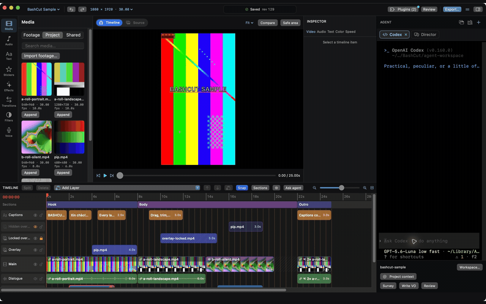

<p align="center">
  
</p>

<h1 align="center">BashCut</h1>

<p align="center">
  A native macOS video editor that coding agents can drive.<br>
  Everything the UI does, Claude Code and Codex can do through the <code>bashcut</code> CLI or MCP.
</p>

<p align="center">
  <a href="https://github.com/dongnguyenvie/BashCut/releases/latest">Download</a> ·
  <a href="https://testflight.apple.com/join/XwsNZxre">TestFlight beta</a> ·
  <a href="docs/README.md">Docs</a> ·
  <a href="docs/guides/automation.md">Automation</a> ·
  <a href="docs/guides/plugins.md">Plugins</a> ·
  <a href="https://github.com/dongnguyenvie/bashcut-agent-kit">Agent kit</a> ·
  <a href="https://github.com/dongnguyenvie/BashCut/issues">Issues</a>
</p>

<p align="center">
  <a href="README.vi.md">Tiếng Việt</a>
</p>

---

<p align="center">
  
</p>

## About

BashCut is a native macOS video editor built on AVFoundation, with a Claude Code / Codex terminal docked beside the
timeline. Preview and export share one composition engine, so what you see is what you export. Projects are
plain JSON next to your footage: agents and scripts read and edit them through the same atomic, undoable edit
operations the UI uses.

BashCut is under active development: the M0 foundation is accepted on real footage and most of the editor and
agent features (M1–M3, M5) are in place. See [implementation status](docs/status/implementation.md) for what is
verified and what is left.

## Use the AI you already pay for

No extra AI bill: BashCut works with the subscriptions and apps you already have.

| You have | How BashCut uses it |
|---|---|
| **Claude subscription** (Pro / Max) | The **Claude** tab in the agent dock runs the real Claude Code CLI with your login. BashCut never passes `ANTHROPIC_API_KEY`, so your plan is used, not API credits |
| **ChatGPT subscription** (Plus / Pro) | The **Codex** tab runs the real Codex CLI with your ChatGPT login |
| **Claude Desktop / Codex app** | Point them at BashCut: `bashcut agent setup claude` or `bashcut agent setup codex` installs the editing skills and the `bashcut` MCP server, so they edit the open project from outside the app |
| **Any other model** (Gemini, GPT, Grok, Mistral, Groq, OpenRouter, a local or OpenAI-compatible server) | Install the **[AI Editor](https://github.com/dongnguyenvie/bashcut-plugins/tree/main/plugins/director)** plugin: a chat agent inside BashCut with your own API key, with thinking levels (`off` / `low` / `medium` / `high`) for reasoning models |

Whichever you pick, the agent edits through the same undoable commands as the UI: every change lands in History,
shows in Show Changes and can be undone. See [Automation](docs/guides/automation.md).

## What's inside

### Editing

- **Layered timeline**: as many video, overlay, text, sticker, adjustment, voiceover, music and SFX layers as you
  need, with linked sound, sections, snapping, multi-select, gaps, split, trim, move, lift and ripple delete
- **Viewer and source viewer**: In/Out, Insert/Overwrite, viewer zoom, safe area and before/after compare
- **Speed**: constant speed, reverse, freeze frames and CapCut-style speed ramps (montage, hero, bullet, jump-cut,
  flash in/out, or your own curve)
- **Motion**: keyframes for position, scale, rotation, opacity and volume, shown on the timeline, plus animation
  presets (zoom, pan, Ken Burns, pop-in, slide-up, zoom-punch); crop and rounded corners
- **Transitions**: dissolve, whip, blink, zoom, spin, shutter, wipe and saved transition presets
- **Still images** and stickers (emoji or image) on the timeline
- **Change the canvas** of an open project (9:16, 16:9, 1:1…) without rebuilding it

### Captions and text

- Transcribe speech into captions with a local Whisper plugin, import and export SubRip
- **Word-by-word captions**: highlight, karaoke and reveal styles
- Text presets for hook titles, place labels, keyword stickers and chapter cards, keeping their style when edited;
  Vietnamese and English throughout

### Color

- LUT import (`.cube`), exposure, contrast and saturation
- **Adjustment layers** and **filter stacks** that grade everything below them
- **Looks** and **style kits**: save a grade (with its LUT) and a caption style, apply them to the next video in one
  step

### Sound

- Volume, fades, volume keyframes, ducking music under speech, loudness normalization at export
- Voiceover recording, and text-to-speech takes through a voice plugin (VieNeu TTS for Vietnamese, cloned voices)
- **Beat grid** from the music, for cutting on the beat
- Measure loudness, true peak and speech-band energy, and **sync** a camera with a screen recording by their sound,
  without ffmpeg

### Library

- One library for music and SFX, text styles, stickers, effect recipes, transition presets and looks: built-in
  items, your own (this project or every project), and packs that plugins ship
- Search, tags, packs, import and export of packs, usage stats, and **search or generate** new items through plugins

### Review and export

- Review checks: gaps in the picture, repeated framing between cuts, long caption lines, speech-recognition loops,
  voiceover too close to real speech; full history; autosave with crash recovery; reload when files change on disk,
  with conflict handling
- Preview proxies for heavy footage; export presets for TikTok, YouTube 1080p and 4K, a quick draft and ProRes,
  queued in the background, with burned-in captions and an optional `.srt`; OTIO export

### AI agents

- **Agent dock**: real Claude Code, Codex and Shell terminals beside the timeline, plus chat agents and terminal
  agents from plugins (AI Editor with your own API key, Antigravity…)
- **Send to Agent**: select clips and send them with your request; the **scope guard** keeps the agent's edits to
  those clips, or asks you first
- **Show Changes**: see what an agent changed, jump to it, and undo it as one step
- **Knowledge**: agents remember lessons, your preferences and project facts between sessions; review them in the
  Knowledge window's inbox, edit project notes and skills, and revert any change from its history
- The **[agent kit](https://github.com/dongnguyenvie/bashcut-agent-kit)**: editing skills (footage survey, beat
  cuts, sound mix, captions, colour, effects, voiceover, style study, self-learning) loaded into every agent tab
- **Agent permissions**: choose what agents may do without asking (edits, exports, plugin actions), or allow
  everything

### Automation

- The `bashcut` CLI and MCP server cover every UI action, dialog, shortcut and view: 140 commands, with dry runs,
  revision checks and one undoable edit per call ([command reference](docs/reference/commands.md))
- `ui frame` renders any frame to a PNG, so an agent can look at its own work
- Command palette (⇧⌘P), a full Mac menu bar and searchable Settings

### Plugins

- Out-of-process plugins in any language: capabilities (transcription, voice, beats, loudness, sync, library search
  and generate), actions in menus and context menus, hooks on editor events, options, chat and terminal agents,
  library packs and **agent skills** that teach agents how to use them
- **Plugin UI**: a plugin can have its own panel in the left rail, tabs in the agent dock and sheets, with views
  BashCut draws natively from the components the plugin sends (lists, forms, buttons, images, audio previews); plugins
  can build on each other (generate speech through your voice plugin, require another plugin)
- A signed [plugin registry](https://github.com/dongnguyenvie/bashcut-plugins) with Browse, one-click install, daily
  update checks, Trust per plugin and dependency setup that never needs Terminal; plugins from a link or a folder
  too. See [Writing plugins](docs/guides/plugins.md)

## Install

Requires macOS 14 or later.

### Homebrew

```sh
brew install --cask dongnguyenvie/tap/bashcut
```

This installs `BashCut.app` into `/Applications` and links the `bashcut` CLI and `bashcut-mcp` server into
Homebrew's `bin`, so agents in any terminal can drive the app. Update with `brew upgrade --cask bashcut`; remove
with `brew uninstall --cask bashcut` (add `--zap` to also delete settings and caches).

### Download a release

Download `BashCut-<version>.dmg` (or `.zip`) from the [latest release](https://github.com/dongnguyenvie/BashCut/releases/latest),
open it and drag BashCut to Applications. Builds are signed with Developer ID and notarized by Apple; check a download
against the release's `SHA256SUMS` with `shasum -a 256 -c --ignore-missing SHA256SUMS`. To use the CLI from a terminal, link it yourself:

```sh
sudo ln -s /Applications/BashCut.app/Contents/MacOS/bashcut /usr/local/bin/bashcut
sudo ln -s /Applications/BashCut.app/Contents/MacOS/bashcut-mcp /usr/local/bin/bashcut-mcp
```

### TestFlight

Join the public beta on [TestFlight](https://testflight.apple.com/join/XwsNZxre) (needs the TestFlight app). The
TestFlight build is the sandboxed Mac App Store build: it runs only the plugins bundled with the app, and its
bundled CLI cannot run from a regular terminal.

Or build BashCut from source, below.

## How to Build

Requires macOS 14+, Xcode with Swift 6, and network access for the first package resolution.

```sh
scripts/run.sh
```

This builds with SwiftPM, packages `build/BashCut.app`, signs it with the first Apple Development identity in
your keychain (or `BASHCUT_SIGN_IDENTITY`) so macOS keeps folder-access grants across rebuilds, and opens it. The
app executable is `BashCutApp` and the bundled CLI is `bashcut`, avoiding a name collision on case-insensitive
disks.

To try a change against every timeline case, generate the [sample project](docs/guides/sample-project.md) shown
above (needs `ffmpeg`):

```sh
scripts/sample-project.py
```

For Xcode, install XcodeGen >= 2.46, then run `scripts/generate-project.sh` and open `BashCut.xcodeproj`
(generated from `project.yml`). Xcode builds the string catalog; the SwiftPM launcher copies equivalent `.strings`
resources. The UI follows the system language.

## Verify

```sh
scripts/verify.sh build
scripts/verify.sh test
scripts/verify.sh perf       # 20 synthetic clips, ~30 seconds, 1080×1920
scripts/verify.sh lint       # requires SwiftLint
scripts/verify.sh xcode test # regenerates and tests the Xcode project (requires XcodeGen)
```

Pure model tests also run on their own with `cd Packages/BashCutCore && swift test`. Tests never use the real
video workspace or agent CLIs, and package downloads happen at dependency resolution, not in tests.

## Related repositories

Two other repositories are part of BashCut. Contributions are welcome in each:

| Repository | What it holds | Contribute there |
|---|---|---|
| [bashcut-plugins](https://github.com/dongnguyenvie/bashcut-plugins) | The plugin registry (`registry.json`) and its plugins: Whisper Captions, VieNeu TTS, Silence Markers, AI Editor and Antigravity | New plugins and fixes to existing ones. See [Writing plugins](docs/guides/plugins.md) |
| [bashcut-agent-kit](https://github.com/dongnguyenvie/bashcut-agent-kit) | Editing skills for Claude Code and Codex (footage survey, beat cuts, audio mix, captions, colour, effects, voiceover…). BashCut ships them and loads them in its agent tabs | Editing know-how that agents should follow. See its README › Writing skills |

Changes to the editor itself, its commands and the plugin API belong in this repository.

## Documentation

- [Documentation index](docs/README.md): guides, reference and design specs
- [Automation: CLI and MCP](docs/guides/automation.md) and the generated
  [command reference](docs/reference/commands.md)
- [Project format](docs/reference/project-format.md)
- [Implementation status](docs/status/implementation.md)
- [CONTRIBUTING.md](CONTRIBUTING.md): build layout and one-file templates (agent providers, model adapters,
  commands, capabilities, timeline formats)
- [CHANGELOG.md](CHANGELOG.md)

## License

MIT. See [LICENSE](LICENSE).
