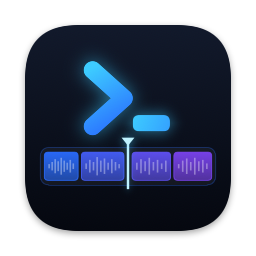
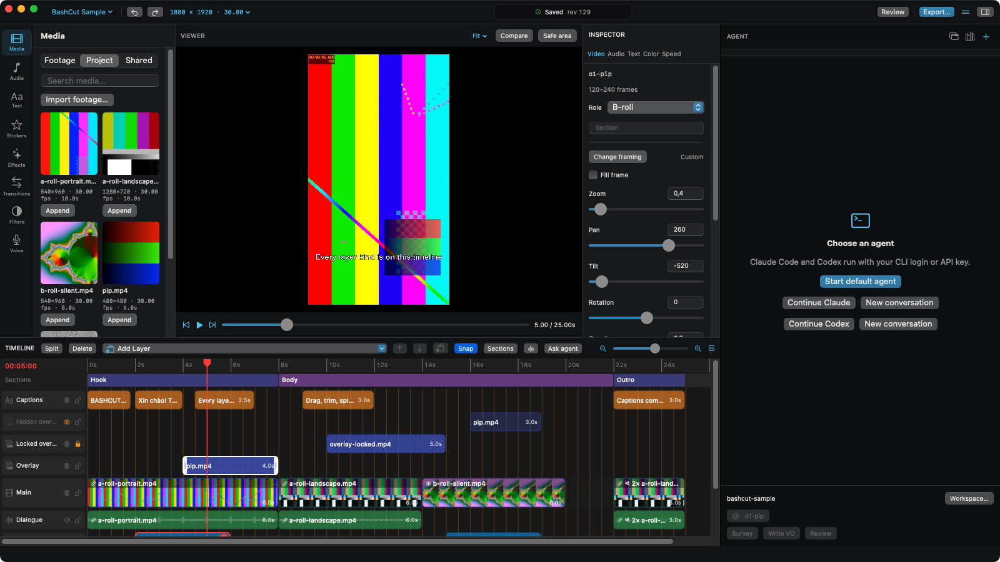

<p align="center">
  
</p>

<h1 align="center">BashCut</h1>

<p align="center">
  Trình dựng video native cho macOS mà coding agent có thể điều khiển.<br>
  Mọi thao tác trên giao diện, Claude Code và Codex đều làm được qua CLI <code>bashcut</code> hoặc MCP.
</p>

<p align="center">
  <a href="https://github.com/dongnguyenvie/BashCut/releases/latest">Tải về</a> ·
  <a href="https://testflight.apple.com/join/XwsNZxre">Beta TestFlight</a> ·
  <a href="docs/README.md">Tài liệu</a> ·
  <a href="docs/guides/automation.md">Tự động hóa</a> ·
  <a href="docs/guides/plugins.md">Plugin</a> ·
  <a href="https://github.com/dongnguyenvie/bashcut-agent-kit">Agent kit</a> ·
  <a href="https://github.com/dongnguyenvie/BashCut/issues">Báo lỗi</a>
</p>

<p align="center">
  <a href="README.md">English</a>
</p>

---

<p align="center">
  
</p>

## Giới thiệu

BashCut là trình dựng video native cho macOS, xây trên AVFoundation, có terminal Claude Code / Codex gắn ngay
cạnh timeline. Preview và export dùng chung một engine dựng hình, nên thứ bạn xem là thứ được xuất ra. Project là
file JSON thuần nằm cạnh footage: agent và script đọc, sửa project qua đúng các thao tác chỉnh sửa nguyên tử, có
undo, mà giao diện đang dùng.

BashCut đang được phát triển tích cực: nền tảng M0 đã được nghiệm thu trên footage thật, phần lớn tính năng dựng
và agent (M1–M3, M5) đã có. Xem [trạng thái triển khai](docs/status/implementation.md) để biết phần nào đã kiểm
chứng và phần nào còn lại.

## Có gì bên trong

- Timeline nhiều layer: audio liên kết, section, snap, beat grid, cắt/trim/di chuyển, khoảng trống, freeze frame,
  đổi tốc độ cố định và speed ramp, keyframe, transition
- Viewer và source viewer với In/Out, Insert/Overwrite, vùng an toàn và so sánh
- Phụ đề và chữ với preset, nhập SRT, hỗ trợ tiếng Việt và tiếng Anh
- Màu: LUT, exposure, contrast, saturation và adjustment layer
- Âm thanh: âm lượng, fade, ducking dưới giọng nói, loudness, thu voiceover, waveform khớp với nguồn
- Review, lịch sử chỉnh sửa, autosave có khôi phục, tự tải lại hoặc báo xung đột khi file bị sửa từ bên ngoài
- Hàng đợi export H.264 có phụ đề burn-in; export OTIO
- Agent dock với terminal Claude, Codex và Shell thật, cùng [agent kit](https://github.com/dongnguyenvie/bashcut-agent-kit)
  chứa các skill dựng video
- CLI `bashcut` và MCP server: mọi thao tác và hộp thoại trên giao diện, có chạy thử (dry run) và kiểm tra revision
- Plugin chạy ngoài tiến trình cho transcription, giọng đọc, beat và loudness, lấy từ
  [plugin registry](https://github.com/dongnguyenvie/bashcut-plugins)

## Cài đặt

Cần macOS 14 trở lên.

### Homebrew

```sh
brew install --cask dongnguyenvie/tap/bashcut
```

Lệnh này cài `BashCut.app` vào `/Applications` và link CLI `bashcut` cùng server `bashcut-mcp` vào `bin` của
Homebrew, để agent ở bất kỳ terminal nào cũng điều khiển được app. Cập nhật bằng `brew upgrade --cask bashcut`; gỡ
bằng `brew uninstall --cask bashcut` (thêm `--zap` để xóa luôn cài đặt và cache).

### Tải bản release

Tải `BashCut-<version>.dmg` (hoặc `.zip`) ở [bản release mới nhất](https://github.com/dongnguyenvie/BashCut/releases/latest),
mở ra rồi kéo BashCut vào Applications. Các bản build được ký Developer ID và Apple notarize; kiểm tra file tải về
với `SHA256SUMS` của release bằng `shasum -a 256 -c --ignore-missing SHA256SUMS`. Muốn dùng CLI từ terminal thì tự tạo link:

```sh
sudo ln -s /Applications/BashCut.app/Contents/MacOS/bashcut /usr/local/bin/bashcut
sudo ln -s /Applications/BashCut.app/Contents/MacOS/bashcut-mcp /usr/local/bin/bashcut-mcp
```

### TestFlight

Tham gia bản beta công khai qua [TestFlight](https://testflight.apple.com/join/XwsNZxre) (cần app TestFlight). Bản
TestFlight là bản Mac App Store có sandbox: chỉ chạy plugin đi kèm app, và CLI đi kèm không chạy được từ terminal
thông thường.

Hoặc build BashCut từ mã nguồn, xem bên dưới.

## Build

Cần macOS 14 trở lên, Xcode có Swift 6, và kết nối mạng cho lần tải package đầu tiên.

```sh
scripts/run.sh
```

Script này build bằng SwiftPM, đóng gói `build/BashCut.app`, ký bằng Apple Development identity đầu tiên trong
keychain (hoặc `BASHCUT_SIGN_IDENTITY`) để macOS giữ quyền truy cập thư mục qua các lần build, rồi mở app. File
thực thi của app là `BashCutApp` và CLI đi kèm là `bashcut`, để tránh trùng tên trên ổ đĩa không phân biệt hoa
thường.

Để thử một thay đổi với mọi trường hợp trên timeline, tạo [project mẫu](docs/guides/sample-project.md) như trong
ảnh trên (cần `ffmpeg`):

```sh
scripts/sample-project.py
```

Với Xcode, cài XcodeGen >= 2.46, chạy `scripts/generate-project.sh` rồi mở `BashCut.xcodeproj` (sinh từ
`project.yml`). Xcode build string catalog; launcher SwiftPM chép các file `.strings` tương ứng. Giao diện theo
ngôn ngữ hệ thống.

## Kiểm tra

```sh
scripts/verify.sh build
scripts/verify.sh test
scripts/verify.sh perf       # 20 clip tổng hợp, ~30 giây, 1080×1920
scripts/verify.sh lint       # cần SwiftLint
scripts/verify.sh xcode test # sinh lại và test project Xcode (cần XcodeGen)
```

Test model thuần cũng chạy riêng được bằng `cd Packages/BashCutCore && swift test`. Test không bao giờ dùng
workspace video thật hay agent CLI, và việc tải package chỉ xảy ra khi resolve dependency, không phải trong test.

## Các repository liên quan

Hai repository khác cũng thuộc BashCut. Mọi đóng góp đều được hoan nghênh:

| Repository | Chứa gì | Đóng góp gì ở đó |
|---|---|---|
| [bashcut-plugins](https://github.com/dongnguyenvie/bashcut-plugins) | Plugin registry (`registry.json`) và các plugin như Silence Markers, VieNeu TTS | Plugin mới và sửa plugin hiện có. Xem [Viết plugin](docs/guides/plugins.md) |
| [bashcut-agent-kit](https://github.com/dongnguyenvie/bashcut-agent-kit) | Skill dựng video cho Claude Code và Codex (khảo sát footage, cắt theo beat, mix âm thanh, phụ đề, màu, hiệu ứng, voiceover…). BashCut đóng gói sẵn và nạp chúng trong các tab agent | Kinh nghiệm dựng mà agent nên làm theo. Xem README › Writing skills của repo đó |

Thay đổi cho chính trình dựng, các lệnh và plugin API thuộc về repository này.

## Tài liệu

Tài liệu chi tiết hiện chỉ có bằng tiếng Anh.

- [Mục lục tài liệu](docs/README.md): hướng dẫn, tham chiếu và đặc tả thiết kế
- [Tự động hóa: CLI và MCP](docs/guides/automation.md) cùng [danh sách lệnh](docs/reference/commands.md) (sinh tự động)
- [Định dạng project](docs/reference/project-format.md)
- [Trạng thái triển khai](docs/status/implementation.md)
- [CONTRIBUTING.md](CONTRIBUTING.md): cấu trúc build và các mẫu một file (agent provider, model adapter, lệnh,
  capability, định dạng timeline)
- [CHANGELOG.md](CHANGELOG.md)
